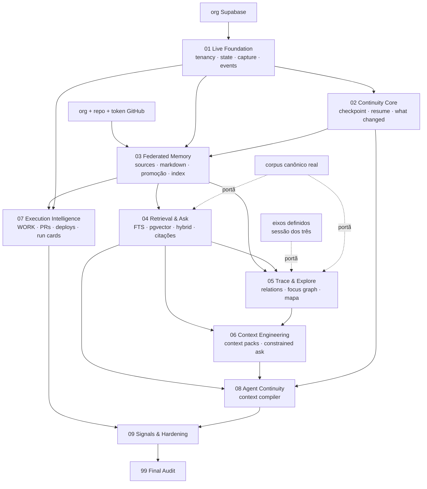

# Master Implementation Plan v1

> Produto do `00_IMPLEMENTATION_PLAN_FREEZE.md`, executado sob
> `00_EXECUTION_KERNEL.md`, a partir do INSPECT/RECONCILE registrado em
> `RECONCILIACAO-PROJECT-OS.md`. Data: 2026-09-01.
>
> **Nenhum código nesta rodada** — o prompt de freeze proíbe. Este documento
> congela o roadmap para que nenhuma rodada seguinte reinterprete a
> arquitetura. Uma fase só pode contrariá-lo registrando formalmente um
> `ARCHITECTURE DEVIATION` com contradição técnica comprovada.

---

## 1. Executive Implementation Strategy

### A situação, em três frases

Existe um app publicado (https://feel-cerebro.vercel.app) que implementa
captura → candidato → promoção → commit no Git: isso é a **Fase 03** do kit,
escrita antes das Fases 01 e 02. Falta inteira a camada que responde *onde
estamos e o que fazer agora* — que é a que gera valor no primeiro dia. E o
único bloqueio externo real (repositório GitHub) trava exatamente a fase que
já está escrita, não as que faltam.

### A estratégia que sai disso

**Construir a fundação que foi pulada, enquanto o código de promoção espera
o GitHub.** Duas trilhas de desbloqueio, independentes entre si:

```
TRILHA A (caminho crítico)          TRILHA B (paralela, não bloqueia A)
org Supabase nova                    org + repo GitHub + token
      ↓                                     ↓
Fase 01 Live Foundation              (nada até a Fase 03)
Fase 02 Continuity Core                     ↓
      └──────────────┬──────────────────────┘
                     ↓
              Fase 03 Federated Memory  ← o código já escrito acorda aqui
```

Consequências operacionais que isso trava:

1. **O caminho crítico é o banco, não o repositório.** Toda a Fase 01 e 02 —
   orientação, continuidade, retomada — precisa só de Postgres.
2. **Nada do que foi construído é descartado.** `/api/promote`, Octokit, o
   fluxo de captura, `itens_inbox`, as policies de RLS: tudo entra na Fase 03
   ou é reaproveitado na 01.
3. **Multi-tenancy entra agora, não depois.** É a única decisão deste plano
   cujo custo de adiar é ordens de grandeza maior que o de fazer (D-01).
4. **Cada fase publica.** Filosofia do kit e nossa: software funcionando em
   produção ao fim de cada fase, não ao fim do plano.

### Princípio de sequenciamento

Risk-first onde há incerteza técnica (promoção Git, RLS multi-tenant,
qualidade de retrieval), value-first onde há incerteza de produto (a Fase 01
precisa entregar orientação real, não login + sidebar). Onde os dois
colidem, valor ganha — porque um sistema tecnicamente correto que ninguém
abre não prova nada.

---

## 2. Closed Operational Decisions

Decisões fechadas. Reabrir exige `ARCHITECTURE DEVIATION` com evidência.
As três marcadas ⚑ vinham da seção 9 da reconciliação e foram fechadas na
recomendação, por não terem sido contestadas.

| # | Decisão | Razão | Custo de reverter |
|---|---|---|---|
| **D-01** ⚑ | **Multi-tenant desde a Fase 01**: `organizations`, `projects`, `organization_members`. Feel é o primeiro projeto dentro. | Mesmo raciocínio já aplicado ao `eixo_id`: coluna que nasce cedo custa nada, retrofit com dados reais custa reescrever toda RLS. | Alto se adiado; baixo agora |
| **D-02** ⚑ | **Vocabulário canônico = Decision, Hypothesis, Evidence, Question, Spec.** `epistemico` e `confianca` continuam como campos ortogonais. `source` e `project-state` deixam de ser tipos de nota. | O kit tipa pelo papel no raciocínio; nós marcamos o estado epistêmico. Os dois juntos são mais expressivos que qualquer um sozinho. `source` vira Source Registry, `project-state` vira tabela. | Médio (migração de dados; hoje há zero notas em produção — custo real ≈ 0) |
| **D-03** ⚑ | **O software se chama Project OS; "Feel" é o primeiro projeto dentro dele.** Os documentos existentes mantêm seus nomes. | Segue D-01. Puramente nominal. | Nulo (find/replace em docs) |
| **D-04** | **Repositório de conhecimento é separado do repositório de código.** `projectos` (código) e `<projeto>-knowledge` (Markdown canônico). | Três razões concretas: (a) cada promoção no repo de código dispararia um build de produção na Vercel; (b) o repo de conhecimento é clonado no Obsidian por quem não precisa do código; (c) histórico de commits não se mistura. | Médio |
| **D-05** | **PAT de escopo restrito na Fase 03; GitHub App obrigatório antes da Fase 07.** | PAT resolve escrita, que é tudo que a 03 precisa. App só se paga quando entram webhooks de execução, PRs e checks (07). | Baixo |
| **D-06** | **`escopo` (`pessoal\|feel\|cliente:`) é aposentado como tenancy.** `project_id` + RLS assume. | Duas verdades de escopo é exatamente o que o Kernel §8 proíbe. | Baixo (zero linhas em produção) |
| **D-07** | **`notas_promovidas` é dividida.** `knowledge_index` (DERIVED, 100% reconstruível do Git) + registro de promoção em `events`. Autoria e origem passam ao frontmatter. | Achado da reconciliação §3.6: hoje a tabela tem campos que não existem no Markdown, então o índice **não** é reconstruível — viola "Derived indexes devem ser reconstruíveis". | Alto se adiado |
| **D-08** | **Identidade dupla: UUID interno + display id `DEC-0001`** (4 dígitos, zero-padded, por projeto e por tipo). Geração por sequência transacional, não por `max()+1`. | Kit 03 §4: "não usar filename como identidade única", "resolver geração sem corrida". Nosso `/api/promote` atual usa `order by criado_em desc limit 1` — é uma corrida real com três pessoas promovendo. | Baixo agora, alto depois de IDs emitidos |
| **D-09** | **Context Pack = Snapshot** (versões/SHAs fixados no momento da criação). Live Collection fica fora do V1. | Reprodutibilidade é o ponto do artefato; coleção viva não é reproduzível. | Baixo |
| **D-10** | **Focus Graph: reaproveitar o renderer de canvas 2D do `cerebro-ui`** como padrão, com `@xyflow/react` 12 como alternativa avaliada na entrada da Fase 05. | Nosso renderer já resolve estabilidade espacial persistida, rótulos com desvio de colisão e paleta verificada contra daltonismo — as partes difíceis. Critério de troca definido em §6, Fase 05. | Baixo (decisão tem ponto de reavaliação embutido) |
| **D-11** | **`eixos` é dimensão por projeto, opcional.** O mapa territorial é uma camada da Fase 05, com portão duplo: eixos definidos **e** corpus canônico existindo. | Preserva a decisão original (mapa exige território estável) e soma a pré-condição do kit para a 05. | Baixo |
| **D-12** | **Modelo de embedding escolhido por benchmark na Fase 04** (PT / EN / misto / linguagem técnica). Não pinado agora. | Kit 04 §1.D. Pinar hoje seria decidir sem dado. | — |
| **D-13** | **Reranking: DEFER.** Trigger: eval da Fase 04 demonstrar ganho mensurável sobre hybrid. | Kit 04 §1.F. | — |
| **D-14** | **Obsidian = clone Git do repo de conhecimento, sem plugin.** | Kit 03 §12. Já era nossa posição. | — |
| **D-15** | **Stack confirmada com versões reais** (verificadas hoje, não de memória): Next.js 16.3.3 · `@supabase/ssr` 0.12.5 · `@octokit/rest` 22.0.1 · AI SDK `ai` 7.x · `@xyflow/react` 12.x se D-10 virar. | Kernel §4. Nota: React Flow foi renomeado — o pacote é `@xyflow/react`, não `reactflow`. | — |
| **D-16** | **Identificadores de schema e de código em inglês; documentação e interface em português.** | Os prompts de fase do kit referenciam `events`, `candidates`, `project_state`, `sources` por esses nomes. Traduzir a cada fase gera atrito permanente e risco de divergência entre plano e schema. A documentação e a UI, que são lidas pelos três, seguem em português. | Baixo (nada aplicado) |

> **Correção registrada em 2026-09-01, após o congelamento.** Ao escrever os
> primeiros movimentos ficou claro que o plano original mandava aplicar
> `0001_init.sql` e depois corrigi-la com quatro migrations (`0003`–`0006`).
> Como **nenhuma migration jamais foi aplicada em banco nenhum**, corrigir um
> arquivo que nunca rodou é trabalho inventado. A base foi reescrita já
> correta como `0001_foundation.sql`, e a versão single-tenant foi preservada
> em `supabase/superseded/0001_init_single_tenant.sql` — não apagada, pelo
> mesmo princípio que vale para o conhecimento. Isso **não** é um
> `ARCHITECTURE DEVIATION`: nenhuma decisão de arquitetura mudou, só o
> empacotamento das migrations. Os movimentos 6–10 da §13 foram atualizados.

---

## 3. Capability Matrix

Classes: **F**oundation · **C**ore · **E**nabler · **D**ifferentiator ·
**M**aturity · **Fut**ure. Valores qualitativos: A(lto) / M(édio) / B(aixo).

| Capacidade | Classe | Valor p/ usuário | Reduz risco | Valor de aprendizado | Custo | Fase |
|---|---|---|---|---|---|---|
| Auth + tenancy (org/project/member) | F | B (invisível) | **A** | B | M | 01 |
| Project State (objective/NOW/NEXT/NOT NOW) | **C** | **A** | M | M | B | 01 |
| Quick Capture → Candidate | C | A | M | M | B | 01 |
| Event Log append-only | F | B | A | M | B | 01 |
| Checkpoint | C | A | M | A | M | 02 |
| Resume determinístico | **D** | **A** | M | **A** | M | 02 |
| What Changed / Needs Attention | C | A | M | M | M | 02 |
| Source Registry | **C** | M | **A** | A | A | 03 |
| Markdown canônico + parser/writer | **C** | M | **A** | A | A | 03 |
| Promoção Git com falha segura | C | M | **A** | A | M | 03 |
| `knowledge_index` reconstruível | E | B | **A** | M | M | 03 |
| FTS + filtros estruturados | E | A | M | M | B | 04 |
| pgvector + hybrid | E | A | M | **A** | A | 04 |
| Ask Project com citações | **D** | **A** | M | **A** | A | 04 |
| Resposta negativa honesta | D | A | **A** | A | B | 04 |
| `relation_index` + origem | E | M | M | A | M | 05 |
| Focus Graph | D | A | B | **A** | A | 05 |
| Mapa territorial por eixos | D | A | B | A | A | 05 |
| Source Inspector | E | M | M | M | M | 03→05 |
| Context Packs | **D** | A | M | **A** | A | 06 |
| Constrained Ask | D | A | A | A | M | 06 |
| WORK + GitHub/Vercel execution | C | A | M | M | A | 07 |
| Run Cards | M | M | B | M | M | 07 |
| Context Compiler (agent cold-start) | **D** | **A** | M | **A** | M | 08 |
| Signals determinísticos | M | M | M | M | M | 09 |
| Reconciliação / reindex | M | B | **A** | M | M | 09 |
| MCP server próprio | Fut | ? | ? | ? | A | trigger 08 |
| Cross-project intelligence | Fut | ? | ? | ? | A | trigger pós-V1 |

---

## 4. Dependency DAG



Caminho crítico: `SB → 01 → 02 → 03 → 04 → 06 → 08 → 09 → 99`.
A Fase 05 sai do caminho crítico — depende de dois portões humanos (eixos
definidos, corpus real) e não bloqueia 06 se a 04 estiver pronta.

---

## 5. Final Phase Map

| # | Nome | Muda vs. hipótese do kit | Depende de GitHub | Complex. | Risco |
|---|---|---|---|---|---|
| 01 | Live Foundation | reaproveita app publicado, auth e UI de captura já existentes | não | **L** | M |
| 02 | Continuity Core | inalterada | não | M | B |
| 03 | Federated Memory | **começa ~70% escrita**; ganha D-07 (split canônico/derivado) e D-08 (id sem corrida) | **sim** | **XL** | **A** |
| 04 | Retrieval & Ask | inalterada | não | L | M |
| 05 | Trace & Explore | **absorve o mapa territorial por eixos**; renderer próprio como padrão (D-10) | não | L | M |
| 06 | Context Engineering | Snapshot fechado (D-09) | não | L | M |
| 07 | Execution Intelligence | GitHub App entra aqui (D-05) | sim | L | M |
| 08 | Agent Continuity | inalterada | não | M | B |
| 09 | Signals & Hardening | inalterada | parcial | M | B |
| 99 | Final Audit | inalterada | — | S | — |

---

## 6. Detailed Phase Contracts

Formato compacto e idêntico em todas as fases. Campos vazios significam
"nada nesta fase", não "esquecido".

### FASE 01 — LIVE FOUNDATION

- **TESE** — O Project OS já funciona como camada persistente de orientação?
- **PROPÓSITO** — Entregar a camada que hoje não existe: onde estamos, o que vem agora, o que fica de fora.
- **VALOR** — Abrir o app e ver objetivo, NOW, NEXT e NOT NOW reais dos três.
- **PERGUNTA DE APRENDIZADO** — Três pessoas mantêm um `project_state` compartilhado sem que ele apodreça?
- **PRÉ-CONDIÇÕES** — Projeto Supabase existindo. Nada de GitHub.
- **DEPENDÊNCIAS** — Nenhuma fase anterior.
- **CAPACIDADES** — tenancy; project CRUD; project_state; Quick Capture; events; RLS.
- **VERTICAL SLICES** — (1) auth+tenancy+RLS; (2) criar/abrir projeto; (3) NOW/NEXT/NOT NOW editáveis; (4) Quick Capture→Candidate; (5) Recent Changes a partir de events.
- **UI** — App Shell: Project Switcher · NOW · WORK · MEMORY · EXPLORE · Settings. NOW funcional; WORK/MEMORY/EXPLORE com empty states reais, sem mock.
- **ROTAS** — `/projects`, `/p/[project]/now`, `/p/[project]/work`, `/p/[project]/memory`, `/p/[project]/explore`, `/p/[project]/settings`.
- **DADOS** — `organizations`, `organization_members`, `projects`, `profiles` (era `pessoas`), `project_state`, `candidates` (era `itens_inbox`, +`project_id`), `events`, `eixos` (+`project_id`), `arquivos_raw` (+`project_id`).
- **MIGRATIONS** — `0003_tenancy.sql`, `0004_project_state.sql`, `0005_events.sql`, `0006_retire_escopo.sql` (D-06).
- **AUTORIZAÇÃO** — RLS por `project_id` via `organization_members`. Roles: owner/builder/viewer. Testar allow **e** deny.
- **SOURCE MODEL** — só upload gerenciado (`arquivos_raw`), sem registry ainda.
- **IA** — nenhuma. Deliberado.
- **RETRIEVAL** — nenhum.
- **GRAPH** — nenhum.
- **INTEGRAÇÕES** — Supabase Auth + Storage. Vercel (já ligado).
- **OBSERVABILIDADE** — logs Vercel/Supabase; cron de keepalive já existe.
- **TESTES** — unit: `NEXT <= 3`, validação de state. DB: RLS allow/deny/anon. E2E: autenticar → criar projeto → definir NOW/NEXT/NOT NOW → Quick Capture → recarregar → persistiu.
- **DOGFOOD** — criar o projeto "Feel"; objetivo real; NOW real; NEXT real; ideias de mapa e super-app em NOT NOW; primeira captura real.
- **DOCS** — `docs/ARCHITECTURE.md`, `docs/SCOPE.md`, `docs/SECURITY.md`, `docs/adr/` com os 5 ADRs mínimos do kit.
- **FALHAS** — Supabase pausado → mensagem clara, não tela branca. Sessão expirada → volta ao login sem perder rascunho de captura.
- **RISCOS** — RLS multi-tenant escrita errada vaza projeto (mitigação: teste de deny obrigatório no gate).
- **FORA DE ESCOPO** — conhecimento canônico no Git, IA, embeddings, Ask, grafo, Context Pack, Run Cards, MCP.
- **ACEITE** — URL de produção · auth · CRUD de projeto · objetivo · NOW · NEXT ≤ 3 · NOT NOW · Candidate por Quick Capture · Recent Changes · RLS verificada · migrations · dogfood.
- **EXIT GATE** — `PHASE 01: PASS/PARTIAL/FAIL` · URL · fluxos críticos · RLS verificada · dogfood · pronto p/ 02?
- **HERDA PARA 02** — events reais, state real, um projeto dogfood vivo.

### FASE 02 — CONTINUITY CORE

- **TESE** — Reduz o Time To Reconstruct Context sem memória semântica?
- **PROPÓSITO** — Transformar estado em experiência de retomada.
- **VALOR** — Voltar depois de dias e entender em segundos o que mudou e o que fazer.
- **PERGUNTA** — Quanto do TTRC cai só com determinismo, sem IA?
- **PRÉ-CONDIÇÕES** — 01 PASS; events reais; dogfood ativo.
- **CAPACIDADES** — checkpoints; last seen; Resume determinístico; What Changed; Needs Attention V0.
- **VERTICAL SLICES** — (1) checkpoint CRUD + confirmação antes de salvar; (2) agregador determinístico de events; (3) regras de atenção; (4) NOW vira tela de reentrada.
- **UI** — hierarquia fixa: NOW → What Changed → Needs Attention → NEXT → Recommended Context → NOT NOW (colapsado).
- **ROTAS** — `/p/[project]/now` (enriquecida), `/p/[project]/checkpoints`.
- **DADOS** — `checkpoints`, `project_visit_state`. `ai_runs` só se a IA entrar de fato.
- **AUTORIZAÇÃO** — RLS em checkpoints.
- **IA** — opcional e condicional: só depois do Resume determinístico funcionar; se entrar, registra `ai_runs`, tem fallback sem IA e nunca substitui state. Caso contrário **DEFER sem forçar**.
- **TESTES** — unit: montador do Resume, regras de sinal, validação de checkpoint. DB: RLS. E2E: criar checkpoint → simular mudanças → reabrir → Resume reflete.
- **DOGFOOD** — checkpoint real; trabalhar; voltar; medir TTRC antes/depois.
- **MÉTRICA** — TTRC BEFORE / AFTER, medição manual registrada.
- **FALHAS** — sem events → Resume explica que não há histórico, não inventa.
- **RISCOS** — Resume virar ruído (mitigação: deduplicação determinística, sem score).
- **FORA DE ESCOPO** — embeddings, grafo, Context Pack, execução GitHub.
- **EXIT GATE** — resultado · TTRC · fluxo de checkpoint · Resume verificado · pronto p/ 03?
- **HERDA PARA 03** — hábito de checkpoint, base de events madura.

### FASE 03 — FEDERATED MEMORY

- **TESE** — Transformamos inputs distribuídos em memória canônica auditável sem criar duas verdades?
- **PROPÓSITO** — A camada de conhecimento durável. É aqui que o código já escrito acorda.
- **VALOR** — Decisões dos três viram Markdown versionado, com proveniência, legível daqui a dois anos.
- **PRÉ-CONDIÇÕES** — 01 e 02 PASS; **repo de conhecimento existindo (D-04); token com escrita (D-05)**.
- **CAPACIDADES** — Source Registry; Knowledge Store; schema Markdown versionado; Candidate review; `knowledge_index` reconstruível; identidade dupla; provenance.
- **VERTICAL SLICES** — (1) Source Registry + adapters (internal, upload, GitHub, git-knowledge); (2) writer/parser Markdown com roundtrip testado; (3) geração de display id sem corrida (D-08); (4) promoção com falha segura; (5) reindex do zero a partir do Git; (6) Memory UI com filtros por tipo.
- **UI** — MEMORY: All · Decisions · Hypotheses · Evidence · Questions · Specs · Candidates. Progressive disclosure por tipo, sem formulário gigante.
- **ROTAS** — `/p/[project]/memory`, `/p/[project]/memory/[id]`, `/p/[project]/sources`, `/p/[project]/sources/[id]`.
- **DADOS** — `sources`; `candidates` expandido (proposed_type/title/body/metadata, confidence, status pending→rejected|promoted); `knowledge_index` (DERIVED); `relations` persistidas no frontmatter. **`notas_promovidas` é substituída** conforme D-07.
- **MIGRATIONS** — `0007_sources.sql`, `0008_knowledge_index.sql`, `0009_candidates_expand.sql`, `0010_display_id_sequence.sql`, `0011_drop_notas_promovidas.sql`.
- **REAPROVEITAMENTO** — `/api/promote`, `src/lib/github.ts`, `src/lib/promocao.ts`, `src/lib/types.ts` e a UI de promoção migram com ajuste de vocabulário (D-02) e de identidade (D-08).
- **AI** — nenhuma obrigatória. Extração continua manual até a Fase 04 justificar.
- **INTEGRAÇÕES** — GitHub via PAT; webhook de push com verificação de assinatura, idempotente, com caminho de reconciliação.
- **TESTES** — unit: roundtrip parser/writer, validação de schema, geração de id, transições de candidate. Integração: escrita GitHub, webhook, reindex, idempotência. E2E: captura → candidate → promover Decision → arquivo existe no Git → Memory mostra → recarregar. **E2E de falha: Git indisponível → candidate NÃO promovido.**
- **DOGFOOD** — promover as decisões reais deste plano: ao menos 1 Decision, 1 Hypothesis, 1 Evidence, 1 Question, 1 Spec.
- **FALHAS** — GitHub fora → promoção falha explicitamente, candidate fica `pending`/`error`. Webhook perdido → reconciliação restaura. Markdown malformado → parser rejeita com erro legível, não corrompe índice.
- **RISCOS (ALTO)** — corrida de display id; índice que não reconstrói; promoção parcial (commit feito, linha não gravada). Mitigação: teste de reindex do zero é critério de gate, não item opcional.
- **FORA DE ESCOPO** — retrieval semântico, Context Pack, Focus Graph completo, execução GitHub.
- **EXIT GATE** — autoridade de conhecimento verificada · promoção Git verificada · **reindex do zero verificado** · provenance verificada.
- **HERDA PARA 04** — corpus canônico real, sources registradas, índice confiável.

### FASE 04 — RETRIEVAL & ASK

- **TESE** — Recuperamos o menor contexto suficiente melhor que busca manual?
- **PRÉ-CONDIÇÕES** — corpus dogfood suficiente (03), `knowledge_index` confiável.
- **CAPACIDADES** — filtros estruturados → FTS Postgres → chunks → embeddings/pgvector → hybrid (RRF) → Ask com citações → resposta negativa.
- **PROGRESSÃO** — implementar **medindo cada estágio**; não pular para semântico antes de FTS provar seu teto.
- **UI** — busca e filtros em MEMORY; Ask como drawer/painel transversal, não página isolada. Escopos: PROJECT e OBJECT.
- **DADOS** — `search_chunks`, coluna `embedding` (pgvector, índice só quando o volume justificar), `ai_runs` (operation, provider, model, tokens, custo, latência, status).
- **AI** — AI SDK `ai` 7.x / AI Gateway. Modelo por env/config por papel, nunca hardcoded na arquitetura.
- **GROUNDING** — conteúdo recuperado é **untrusted**; sources não alteram system rules; IA não age sobre state; conhecimento de mundo nunca aparece como evidência do projeto.
- **PERMISSÕES** — corpus = acesso do usuário ∩ escopo do projeto ∩ permissão da source. Filtrar **antes** do prompt, nunca depois.
- **RESPOSTA NEGATIVA** — "a evidência disponível é insuficiente" é resultado de **sucesso** quando apropriado.
- **EVAL** — dataset dogfood real: factual, rationale, temporal, semântico, source-specific, negativo. Medir hit/recall, correção da fonte, fidelidade, correção do "não sei".
- **FALHAS** — embeddings fora → FTS segue. IA fora → busca segue. Índice vetorial velho → lexical segue.
- **FORA DE ESCOPO** — Focus Graph completo, Context Pack, reranking (D-13).
- **EXIT GATE** — eval de retrieval · atribuição de fonte verificada · resposta negativa verificada.

### FASE 05 — TRACE & EXPLORE

- **TESE** — Relações estruturadas e Focus Graph reduzem o esforço de reconstruir rationale?
- **PORTÕES (duplo, D-11)** — eixos definidos pelos três **e** corpus canônico real.
- **CAPACIDADES** — `relation_index` com origem; queries de grafo antes da UI; Focus Graph; Source Inspector V1; mapa territorial por eixos.
- **QUERIES PRIMEIRO** — Why? · Evidence · Dependencies · Implementation · Supersession/History · Impact. Sem query, sem grafo.
- **DADOS** — `relation_index` (project_id, source_entity_id, target_entity_id, relation_type, **origin**, status, confidence nullable, evidence refs). Origem: explicit / structural / semantic / inferred — visualmente distintas; inferida exige confirmação para virar canônica.
- **RENDERER** — padrão: canvas 2D do `cerebro-ui` (estabilidade espacial persistida, rótulos com desvio de colisão, paleta verificada). **Critério para trocar por `@xyflow/react` 12**: se multi-seleção, isolamento de seleção e "adicionar ao contexto" (necessidades da Fase 06) custarem mais para portar do que para adotar a lib.
- **MAPA TERRITORIAL** — camada por eixo sobre o Focus Graph, não tela separada.
- **FORA DE ESCOPO** — Global Graph por padrão, banco de grafo, inferência canônica automática.
- **EXIT GATE** — cenário de trace verificado · utilidade do Focus Graph · **"graph DB necessário?" esperado NÃO**.

### FASE 06 — CONTEXT ENGINEERING

- **TESE** — Contexto curado supera "mandar o projeto inteiro" ou retrieval automático?
- **CAPACIDADES** — Context Workspace; Context Pack Snapshot (D-09); constrained Ask; Compare/Synthesize; Candidate a partir de síntese.
- **DADOS** — `context_packs`, `context_pack_items` (pin de entity/source id, versão/hash/commit SHA, filtros, profundidade de relação, propósito).
- **CONSTRAINED ASK** — `USE ONLY THIS CONTEXT PACK`: retrieval não amplia corpus; insuficiência declarada; instruções de sistema fora do contexto untrusted.
- **EVAL** — A (retrieval amplo) vs B (auto) vs C (pack curado): precisão da fonte, fidelidade, tamanho, custo, alucinação, esforço do usuário. Não concluir superioridade antes de medir.
- **REGRA** — síntese pode criar Candidate; **nunca** promove sozinha.
- **EXIT GATE** — eval do Context Pack · escopo restrito verificado · achado de eficiência de contexto.

### FASE 07 — EXECUTION INTELLIGENCE

- **TESE** — Ligamos WHY/STATE/MEMORY à execução real sem duplicar o GitHub?
- **PRÉ-CONDIÇÕES** — **GitHub App (D-05)**; specs canônicas; relations.
- **CAPACIDADES** — adapters GitHub (repo, branches, commits, PRs, checks); Vercel deployment intelligence; WORK; Run Cards; What Changed enriquecido.
- **WORK (não é Kanban)** — objetivo atual · spec ativa · próxima ação esperada · status de execução · decision relacionada · PRs/commits · checks · último deploy · blockers.
- **DADOS** — `run_cards`, refs/cache derivado de GitHub e Vercel. GitHub e Vercel continuam autoridade; guardamos referência, não verdade.
- **TRACE ALVO** — Evidence → Decision → Spec → PR → Deploy, atravessável no Focus Graph.
- **FALHAS** — GitHub fora → execução em cache com indicador de "stale"; state e memory intactos.
- **FORA DE ESCOPO** — issue tracker próprio, board genérico, agente autônomo de código.
- **EXIT GATE** — autoridade GitHub verificada · valor do WORK · trace de execução verificado.

### FASE 08 — AGENT CONTINUITY

- **TESE** — Reduzimos o cold-start de um agente com contexto pequeno e rastreável?
- **CAPACIDADES** — Context Compiler determinístico em estrutura, configurável em conteúdo; saída `context.md` + JSON; orçamento de tokens sem truncar em silêncio; UI "Continue With AI".
- **PRIORIDADE AO ESTOURAR ORÇAMENTO** — State/Spec/Decisions primeiro; avisar; permitir revisar.
- **PROMPT INJECTION** — compilador separa regras confiáveis / conteúdo de fonte / tarefa. Texto de fonte **nunca** vira camada de instrução.
- **MCP** — portão explícito: só adotar se o agente precisar consultar dinamicamente e o pacote estático for insuficiente. Caso contrário DEFER com trigger registrado.
- **EVAL** — A (sem contexto) vs B (dump completo) vs C (contexto compilado): correção, contexto irrelevante, aderência à fonte, tokens, esforço de reorientação.
- **EXIT GATE** — compiler verificado · eval de cold-start · decisão de MCP documentada.

### FASE 09 — SIGNALS & V1 HARDENING

- **CAPACIDADES** — catálogo de sinais determinísticos (NOW ausente, checkpoint velho, decision superseded ainda referenciada, spec implementada com status velho, índice desatualizado, sync falhando); Decision Debt e Context Debt como explicação, **sem Health Score**; ferramentas de reconciliação (reindex, re-sync, rebuild relations, recompute embeddings).
- **AUDITORIAS** — confiabilidade (outages, webhook duplicado, promoção falha, Markdown malformado), segurança (RLS, secrets server-only, assinatura de webhook, sanitização de Markdown, vazamento entre projetos, injeção de prompt, escopo do agente), performance real, estados de UX.
- **MÉTRICAS** — TTRC · tempo de recuperação de decisão · custo de manutenção de contexto · precisão de atribuição de fonte · qualidade de retrieval · eficiência de Context Pack · cold-start de agente.
- **SUITE DE DOGFOOD** — cenários A–H do kit, cada um PASS/PARTIAL/FAIL.
- **AUDITORIA "DO NOT BUILD"** — confirmar que não entraram por dentro: graph DB, microserviços, framework multi-agente, clone de Notion/Jira, event sourcing, workflow builder.
- **EXIT GATE** — segurança · confiabilidade · suite de dogfood · V1 pronto para auditoria final?

---

## 7. Database Evolution

| Tabela | Autoridade | Canônica/Derivada | Fase | Modelo de RLS |
|---|---|---|---|---|
| `organizations` | Postgres | canônica | 01 | membro da org |
| `organization_members` | Postgres | canônica | 01 | próprio + owner da org |
| `profiles` | Supabase Auth + Postgres | canônica | 01 | próprio; leitura entre membros |
| `projects` | Postgres | canônica | 01 | via `organization_members` |
| `project_state` | Postgres | canônica | 01 | por `project_id` |
| `events` | Postgres | canônica (append-only) | 01 | leitura por projeto; escrita por serviço |
| `candidates` | Postgres | canônica | 01→03 | por `project_id` |
| `arquivos_raw` | Supabase Storage + Postgres | canônica | 01 | por `project_id` |
| `eixos` | Postgres | canônica | 01 | por `project_id` |
| `checkpoints` | Postgres | canônica | 02 | por `project_id` |
| `project_visit_state` | Postgres | canônica | 02 | próprio usuário |
| `sources` | Postgres (registry) | canônica | 03 | por `project_id` + permissão da fonte |
| Markdown no Git | **Git** | **canônica** | 03 | permissão do repositório |
| `knowledge_index` | Postgres | **DERIVADA** (reconstruível) | 03 | por `project_id` |
| `relation_index` | Postgres | **DERIVADA** | 03→05 | por `project_id` |
| `search_chunks` | Postgres | DERIVADA | 04 | herda da entidade |
| `embeddings` (pgvector) | Postgres | DERIVADA | 04 | herda da entidade |
| `ai_runs` | Postgres | canônica (log) | 04 | por `project_id` |
| `context_packs` / `_items` | Postgres | canônica | 06 | por `project_id` + criador |
| `run_cards` | Postgres | canônica | 07 | por `project_id` |
| `signals` | Postgres | DERIVADA | 09 | por `project_id` |
| ~~`notas_promovidas`~~ | — | **removida (D-07)** | 03 | — |
| ~~`escopo`~~ (coluna) | — | **removida (D-06)** | 01 | — |

Regra permanente: toda mudança estrutural por migration versionada; toda
tabela exposta com RLS; testar allow **e** deny.

---

## 8. Route / UI Evolution

| Rota | 01 | 02 | 03 | 04 | 05 | 06 | 07 | 08 |
|---|---|---|---|---|---|---|---|---|
| `/projects` | ✅ | | | | | | | |
| `/p/[project]/now` | ✅ | ⬆ resume | | | | | ⬆ execução | |
| `/p/[project]/work` | empty | | | | | | ✅ real | |
| `/p/[project]/memory` | candidates | | ✅ canônica | ⬆ busca | | | | |
| `/p/[project]/memory/[id]` | | | ✅ | | ⬆ trace | | | |
| `/p/[project]/explore` | empty | | | ⬆ busca | ✅ grafo + mapa | ⬆ seleção | | |
| `/p/[project]/sources` | | | ✅ | | ⬆ inspector | | | |
| `/p/[project]/checkpoints` | | ✅ | | | | | | |
| `/p/[project]/context/[id]` | | | | | | ✅ | | |
| `/p/[project]/settings` | ✅ | | ⬆ knowledge store | ⬆ modelo IA | | | ⬆ GitHub App | |
| Ask (drawer global) | | | | ✅ | | ⬆ constrained | | |
| Quick Capture (global) | ✅ | | ⬆ tipos | | | | | |
| Continue With AI | | | | | | | | ✅ |

---

## 9. Integration Evolution

| Integração | 01 | 03 | 04 | 07 |
|---|---|---|---|---|
| Supabase Auth | magic link | | | |
| Supabase Postgres | tabelas + RLS | +registry/index | +pgvector | |
| Supabase Storage | uploads | fonte registrada | | |
| Vercel | hosting + cron (já ativo) | | | + deployment intelligence |
| GitHub | — | **PAT + webhook de push** | | **GitHub App** (webhooks de PR/checks) |
| Provedor de IA | — | — | AI SDK 7 + gateway, modelo por config | |

---

## 10. AI / Retrieval / Graph Evolution

**IA** — 01/02 sem IA (o Resume determinístico primeiro prova quanto do
problema é resolvido sem ela). 04 introduz IA com `ai_runs` e fallback. 06
restringe a IA a um contexto explícito. 08 compila contexto para agentes
externos. 09 audita se as detecções são úteis ou ruído. Em nenhuma fase a
IA vira autoridade.

**Retrieval** — filtros → FTS → chunks → embeddings → hybrid → (rerank só
com evidência). Cada estágio medido antes do seguinte. Permissão aplicada
na consulta, nunca no prompt.

**Graph** — relações persistidas no Markdown (03) → projetadas em
`relation_index` com origem (05) → queries nomeadas antes de qualquer UI →
Focus Graph com 1–2 saltos → mapa territorial por eixos como camada. Global
Graph fica como "advanced" e só se o custo marginal for baixo. Banco de
grafo: só com limitação concreta do Postgres demonstrada em query real.

---

## 11. Dogfood Roadmap

| Fase | O que os três passam a fazer de verdade |
|---|---|
| 01 | Projeto "Feel" criado; objetivo, NOW, NEXT e NOT NOW reais; primeira captura |
| 02 | Checkpoint ao fim de cada sessão de trabalho; medir TTRC ao voltar |
| 03 | Promover as decisões deste plano: ≥1 de cada tipo canônico |
| 04 | Perguntar ao sistema "por que decidimos X?" e conferir a citação |
| 05 | Reconstruir visualmente uma decisão real: Evidence → Hypothesis → Decision → Spec |
| 06 | Um Context Pack real comparado com retrieval automático |
| 07 | Um trace real Spec → PR → Deploy do próprio sistema |
| 08 | Iniciar uma sessão nova de agente com contexto compilado |
| 09 | Rodar os oito cenários A–H e registrar PASS/PARTIAL/FAIL |

---

## 12. Risk Register

| # | Risco | Prob. | Impacto | Mitigação | Fase |
|---|---|---|---|---|---|
| R-01 | Org Supabase não criada trava tudo | **alta** | **alto** | é o único item do caminho crítico; nada avança sem | 01 |
| R-02 | RLS multi-tenant mal escrita vaza projeto | média | **alto** | teste de deny obrigatório no gate, não opcional | 01 |
| R-03 | `knowledge_index` não reconstrói do Git | média | **alto** | D-07 + reindex do zero como critério de gate | 03 |
| R-04 | Corrida na geração de display id com 3 pessoas | **alta** | médio | D-08, sequência transacional | 03 |
| R-05 | Promoção parcial (commit ok, banco não) | média | alto | commit primeiro, índice depois, reconciliação por reindex | 03 |
| R-06 | Eixos nunca serem definidos → Fase 05 nunca abre | média | médio | 05 sai do caminho crítico; 06 não depende dela | 05 |
| R-07 | Retrieval semântico decepcionar | média | médio | medir cada estágio; FTS sozinho já entrega valor | 04 |
| R-08 | Custo de manutenção maior que a dor evitada | média | **alto** | métrica explícita na 09 e no audit final | 09/99 |
| R-09 | Escopo inflar para Notion/Jira | média | alto | auditoria "Do Not Build" na 09 | 09 |
| R-10 | Vercel Hobby virar impedimento ao sair do protótipo | baixa | médio | gatilho já registrado em `CEREBRO-DA-FEEL.md` §3 | — |
| R-11 | Supabase free pausar por inatividade | média | baixo | cron de keepalive já escrito e ativo | 01 |
| R-12 | Sessão futura reinterpretar a arquitetura | média | médio | este documento + regra de `ARCHITECTURE DEVIATION` | todas |

---

## 13. Os primeiros 52 movimentos concretos

Marcação: **[SB]** precisa da org Supabase · **[GH]** precisa do repo/token
GitHub · **[—]** não precisa de nada externo.

**Desbloqueio (humano)**
1. [—] **Liberar um slot de projeto free na Supabase.** ⚠️ Correção de 2026-09-01: o limite de 2 projetos free ativos é **por usuário, em todas as orgs onde ele é Owner/Admin** — criar uma organização nova não dá um terceiro slot ([doc oficial](https://supabase.com/docs/guides/platform/billing-on-supabase)). Opções: pausar `marim-figital` ou `radar-da-rede` (grátis, reversível, dados intactos), ou subir uma org para Pro (US$25/mês). A escolha da organização virou preferência, não bloqueio.
2. [—] Criar org GitHub + repo de **código** (`projectos`, privado).
3. [—] Criar repo de **conhecimento** separado (D-04), privado.
4. [—] Gerar PAT fine-grained com escrita nos dois repos.

**Fundação de dados — Fase 01**
5. [SB] `confirm_cost` + `create_project` na org nova.
6. ✅ **feito** — `0001_foundation.sql` escrita: 10 tabelas (profiles, organizations, organization_members, projects, project_state, state_items, events, raw_files, candidates, axes), 4 helpers `SECURITY DEFINER`, RLS completa, `NOW = 1` e `NEXT <= 3` impostos por constraint.
7. ✅ **feito** — `0002_storage.sql` atualizada (bucket `raw-files`, D-16).
8. ✅ **feito** — `supabase/tests/rls_test.sql`: allow **e** deny, três personas, transação com rollback. Mitiga R-02.
8b. ✅ **feito e VERIFICADO** — `supabase/tests/verify.sh` sobe um Postgres 16 local descartável, aplica o stub do ambiente Supabase (`auth.users`, `auth.uid()`, roles, `storage`), aplica as duas migrations e roda o teste. **Resultado: `RLS TEST: PASS`.** Pegou um bug real antes de qualquer dado existir: `NOW = 1` estava numa constraint `deferrable initially deferred`, que só falha no commit — o segundo NOW passava no insert. Corrigido com índice único parcial (`idx_one_now_per_project`), que é sempre imediato.
9. ~~`0005_events.sql`~~ — absorvido pelo movimento 6.
10. ~~`0006_retire_escopo.sql`~~ — desnecessário: a base nova já nasce sem `escopo`.
11. ✅ **feito** — `0001_foundation` e `0002_storage` aplicadas em `rvctaywzzipimrpjfkqi`.
11b. ✅ **feito** — `0003_harden_functions` e `0004_private_schema`: fecham os 9 avisos do security advisor. **Advisor agora retorna zero.** Duas tentativas de correção erradas foram pegas pelo teste local antes de irem para produção (ver cabeçalho de `0004`).
12. ✅ **feito** — `RLS TEST: PASS` local contra SQL idêntico; em produção: 10 tabelas, RLS ativa em todas, 20 policies, helpers fora do schema exposto.

**Aplicação — Fase 01**
13. [—] Reestruturar rotas para `/projects` e `/p/[project]/*`.
14. [—] App Shell: Project Switcher, NOW, WORK, MEMORY, EXPLORE, Settings.
15. [—] Formulário de criação de projeto (nome · o que estamos construindo · por que precisa existir).
16. [—] Transação de criação: project + project_state inicial + event.
17. [—] Tela NOW: objetivo, NOW único, NEXT com add/edit/remove/reorder e trava em 3.
18. [—] NOT NOW: capturar, remover, promover para NEXT.
19. [—] Recent Changes a partir de `events`.
20. [—] Migrar a UI de captura atual para Quick Capture global (atalho de teclado).
21. [—] `/api/inbox` → `/api/candidates`, com `project_id`.
22. [—] MEMORY mostra candidates marcados claramente como "não canônico".
23. [—] WORK e EXPLORE com empty states reais, sem dado falso.
24. [—] Testes unit: `NEXT ≤ 3`, validação de state.
25. [—] E2E: autenticar → criar projeto → NOW/NEXT/NOT NOW → capturar → recarregar → persistiu.
26. [SB] Variáveis de ambiente na Vercel + redeploy + verificação em produção.
27. [SB] Criar as linhas de `profiles` dos três após o primeiro login real de cada um.
28. [—] `docs/ARCHITECTURE.md`, `SCOPE.md`, `SECURITY.md` e os 5 ADRs mínimos.
29. [SB] **Dogfood**: projeto "Feel" com objetivo, NOW, NEXT e NOT NOW reais.
30. [—] Fechar gate da Fase 01.

**Continuidade — Fase 02**
31. [SB] `0007_checkpoints.sql` + `project_visit_state`.
32. [—] UI de checkpoint com confirmação antes de salvar e histórico simples.
33. [—] Agregador determinístico de What Changed (deduplicado).
34. [—] Needs Attention: só regras determinísticas, sem score.
35. [—] NOW vira tela de reentrada, com a hierarquia visual fixa.
36. [—] Recommended Context V0 (checkpoint + candidates + events recentes), rotulado como limitado.
37. [—] E2E: checkpoint → mudanças → reabrir → Resume correto.
38. [—] **Dogfood**: medir e registrar TTRC antes/depois.
39. [—] Fechar gate da Fase 02.

**Memória canônica — Fase 03**
40. [GH] Configurar Knowledge Store (repo, branch, root_path) em Settings.
41. [SB] `0008_sources.sql` — Source Registry com authority_class, locator, version/hash, sync_state.
42. [SB] `0009_knowledge_index.sql` (DERIVADA) + `0010_display_id_sequence.sql` (D-08).
43. [—] Writer de Markdown determinístico com frontmatter completo (autoria e source_refs inclusos — D-07).
44. [—] Parser com validação de malformado + teste de roundtrip.
45. [—] Migrar `/api/promote` para o novo vocabulário (D-02) e a nova identidade (D-08).
46. [GH] Promoção real: commit → índice; falha do Git mantém candidate `pending`.
47. [GH] Webhook de push com assinatura verificada, idempotente.
48. [—] Comando de reindex: apagar `knowledge_index` e reconstruir só do Git.
49. [—] Memory UI por tipo canônico + Source Inspector V0.
50. [—] E2E de falha: Git indisponível → **não** promove.
51. [GH] **Dogfood**: promover ≥1 Decision, Hypothesis, Evidence, Question e Spec deste plano.
52. [—] Fechar gate da Fase 03.

Movimentos 1–39 não dependem do GitHub. Só do 40 em diante a trilha B
importa.

---

## 14. Execution Input Contracts

O que cada sessão de execução recebe como entrada, para não precisar
reconstruir contexto.

| Fase | Entrada obrigatória |
|---|---|
| **01** | este plano §6/§13 · `0001`+`0002` aplicadas · projeto Supabase ativo · repo do app · URL de produção |
| **02** | 01 PASS · schema de events · projeto dogfood com histórico real |
| **03** | 01+02 PASS · repo de conhecimento · token · D-02/D-04/D-07/D-08 · código de promoção atual |
| **04** | 03 PASS · corpus canônico ≥ 20 objetos · `knowledge_index` confiável · eval set redigido |
| **05** | 03 PASS · vocabulário de relações congelado · **eixos definidos** · corpus real |
| **06** | 04 PASS · (05 desejável) · Source Registry · permissões |
| **07** | 03 PASS · GitHub App · specs canônicas |
| **08** | 04+06 PASS · Context Packs · state e memory reais |
| **09** | 01–08 com gates ou desvios documentados |
| **99** | V1 completo em produção com uso dogfood real |

---

## 15. Final Gate

```
IMPLEMENTATION PLAN:     PASS
ARCHITECTURE REOPENED:   NO
ARCHITECTURE DEVIATION:  NENHUMA
READY FOR PHASE PROMPTS: YES

BLOCKERS:
  B-01  ✅ RESOLVIDO em 2026-09-01. Projeto `feel-cerebro`
        (rvctaywzzipimrpjfkqi) criado, migrations aplicadas, advisor limpo.
        Vaga liberada pausando `marim-figital` (reversível).
  B-02  Repo GitHub + token — bloqueia SOMENTE a Fase 03 em diante.
        Movimentos 1–39 avançam sem isso.

DECISÕES FECHADAS:       15 (D-01 a D-15)
PRÓXIMA AÇÃO:            Fase 01, movimentos 13-25 (camada de aplicação).
                         Depende só das env vars na Vercel.
```

---

## 16. Rastreabilidade

Deriva de: `docs-kit/` (Project OS Prompt Kit v1, 14 arquivos),
`RECONCILIACAO-PROJECT-OS.md` (INSPECT/RECONCILE),
`CEREBRO-DA-FEEL.md` (documento fundacional),
`MODELO-DE-DADOS.md` (schema original),
`SETUP-INFRAESTRUTURA.md` (estado real da infraestrutura),
e do estado verificado em produção em 2026-09-01: app publicado em
https://feel-cerebro.vercel.app, migrations `0001`/`0002` escritas e não
aplicadas, seis tabelas especificadas, nenhum projeto Supabase existindo.
